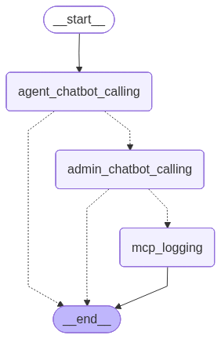

# Schiphol Parking Reservation Assistant

A **Python-based intelligent assistant** for managing parking reservations at Schiphol Airport.
The system integrates a **chatbot**, an **administrative approval agent**, and a **secure reservation logging server** to streamline parking operations while ensuring **data integrity, traceability, and security**.

---

# Features

* **Chatbot Agent** – Converses with users and collects parking reservation requests.
* **Admin Agent** – Reviews reservation requests and approves or rejects operations.
* **Reservation Logging** – Secure logging of reservation actions via a FastAPI server using API authentication.
* **MCP Server Integration** – Handles backend reservation operations and logging.
* **Data Sanitization** – Validates and parses user input to ensure consistent and safe data handling.
* **Database Integration**

  * **SQLite** for structured reservation data.
  * **Weaviate** for semantic storage and RAG-based information retrieval.
* **Tool Integration** – Helper tools for database search and information retrieval.
* **Environment Configuration** – Uses `.env` variables to securely manage API keys and service endpoints.

---

# Prerequisites

Make sure the following tools are installed before running the project:

* **Python 3.11**
* **Docker**
* **Docker Compose**

You will also need to create your own API keys for:

* OpenAI
* Weaviate
* LangSmith Graph
* FastAPI logging server

---

# Installation

## 1. Clone the Repository

```bash
git clone https://github.com/gabrielacretu-ui/Schiphol-Parking-Reservation-Assistant.git
cd Schiphol-Parking-Reservation-Assistant
```

## 2. Install Dependencies

```bash
pip install -r requirements.txt
```

---

# Environment Configuration

Create a `.env` file in the **project root directory** and add the following variables:

```env
OPENAI_API_KEY=<your_openai_key>
WEAVIATE_URL=<your_weaviate_instance_url>
LANGSMITH_GRAPH_URL=<your_langsmith_graph_url>
FASTAPI_LOG_SERVER=<fastapi_server_url>
FASTAPI_API_KEY=<your_fastapi_key>
```

---


# Setup & Initialization

Follow the steps below **in order**.

---

## 1. Start Weaviate Containers

```bash
docker-compose up -d
```

This command creates the required **Weaviate containers** used for semantic data storage.

---

## 2. Initialize the Databases

Run the initialization scripts to create and populate the databases with **sample data**. Make sure to have your Docker open.

```bash
python INITIALIZATION_sqlite_db.py
python INITIALIZATION_weaviate_vector_db.py
```

These scripts initialize:

* **SQLite database** – stores structured reservation data used by tools.
* **Weaviate database** – stores static data used for **RAG-based retrieval**.

---

## 3. Start the FastAPI Logging Server
Before doing this please kill all actions on that port if you have any.
```bash
python -m uvicorn app.MCP_SERVER:app --port 8001
```

This server:

* Logs reservation operations
* Exposes an API endpoint for audit tracking

You can access the reservation logging endpoint documentation at:

```
http://127.0.0.1:8001/docs
```

Authentication is handled using your **FastAPI API key**.

---

## 🚀 Running the System

The project is split into multiple stages, each adding more functionality to the system.

---

## 🧹 Data Validation

* A `validate` function checks if user input already exists in the database
* Uses **fuzzy matching** to handle typos and small input errors

---

## 🚗 Vehicle Validation

* Focused on **Schiphol Airport** to keep the domain realistic
* Uses the **RDW open data API** with async calls
* Validates Dutch license plates using the `vehicle` library

🔗 Data source:
[https://opendata.rdw.nl/Voertuigen/Open-Data-RDW-Gekentekende_voertuigen/m9d7-ebf2/data_preview](https://opendata.rdw.nl/Voertuigen/Open-Data-RDW-Gekentekende_voertuigen/m9d7-ebf2/data_preview)

---

## 🧑 Name Standardization

* Capitalizes each part of the name
* Keeps Dutch prefixes lowercase (*van*, *de*, *der*, *ter*)

---

## 🤖 Stage 1 — Chatbot

Run the chatbot:

```bash id="g7h8i9"
python -m Stage_1.Stage_1
```

Run tests:

```bash id="j1k2l3"
python -m unittest Stage_1.test_stage_1_chatbot
```

* Tests simulate different user requests
* Ensures the chatbot behaves correctly

---


## Stage 2 — Chatbot + Admin Approval

```bash
python -m Stage_2.Stage_2
```

Adds the **admin agent** that reviews reservation operations before execution.
```bash
python -m unittest Stage_2.test_stage_2_chatbot_admin
```

---
Unit tests for the last two stages were excluded because their purpose was limited. After admin validation, all subsequent operations are largely mechanical and can be verified by checking the database, inspecting the FastAPI endpoints, or reviewing the log files to confirm that values were correctly recorded.
## Stage 3 — Logging Integration

```bash
python -m Stage_3.Stage_3.py"
```

Extends the system with:

* MCP server logging
* File logging of operations

---

## Stage 4 — Graph-Based Agent Workflow

```bash
python -m Stage_4.Stage_4.py
```

Runs the **LangGraph-based workflow** that combines multiple system components.

Main nodes:

* **Chatbot Agent**
* **Admin Agent**
* **MCP Server Logging**

---

# Usage Workflow

1. A user submits a parking reservation request through the **chatbot agent**.
2. The **admin agent** reviews the request.
3. If approved, the operation is executed.
4. The operation is logged securely via the **MCP FastAPI server**.
5. Reservation logs can be accessed through the **FastAPI endpoint** for auditing and monitoring.

---

# System Architecture



---

# Project Structure

```
Schiphol-Airport-Parking-Reservation-Assistant
│
├── app
│   ├── AGENT_CHATBOT.py
│   ├── AGENT_ADMIN.py
│   ├── GUARD_RAILS.py
│   ├── MCP_SERVER.py
│   └── MCP_SERVER_calling.py
│
├── db
│   ├── dynamic_parking.db
│   ├── INITIALIZATION_sqlite_db.py
│   ├── INITIALIZATION_weaviate_vector_db.py
│   ├── General_Terms_and_Conditions_Schiphol_Parking.pdf
│   └── dutch_valid_car_numbers_sample.pdf
│
├── collections
│   ├── classifications.db
│   ├── modules.db
│   ├── schema.db
│   ├── migration1.22.fs.hierarchy
│   ├── migration1.19.filter2search.state
│   ├── migration1.19.filter2search.skip.flag
│   ├── static_parking_info_collection
│   └── raft
│
├── functions
│   ├── FUNCTIONS_SANITIZE_input.py
│   ├── FUNCTION_helpers_READ_tools.py
│   └── FUNCTION_helpers_WRITE_tools.py
│
├── tools
│   ├── TOOLS_weaviate.py
│   ├── TOOLS_sqlite_READ.py
│   ├── TOOLS_sqlite_WRITE.py
│   └── TOOLS_human_agent.py
│
├── Stage_1
│   ├── Stage_1.py
│   └── test_stage_1_chatbot.py
│
├── Stage_2
│   ├── Stage_2.py
│   └── test_stage_2_chatbot_admin.py
│
├── Stage_3
│   └── Stage_3.py
│
├── Stage_4
│   ├── Stage_4.py
│   └── graph.png
│
├── logs
│   └── confirmed_reservations_events.txt
│
├── config
│   ├── requirements.txt
│   └── docker-compose.yaml
│
├── .venv
└── README.md
```

---

# License

This project is licensed under the **MIT License**.

---

# Author

**Gabriela Creţu**
EPAM Systems

Contact:
[gabriela_cretu@epam.com](mailto:gabriela_cretu@epam.com)

---

If you want, I can also make a **much stronger GitHub README (like senior engineers do)** by adding:

* **Architecture diagram**
* **Agent interaction flow**
* **Example chatbot conversation**
* **Example API logging request**
* **Better repo badges**

It would make the repo look **significantly more professional for EPAM reviewers**.
